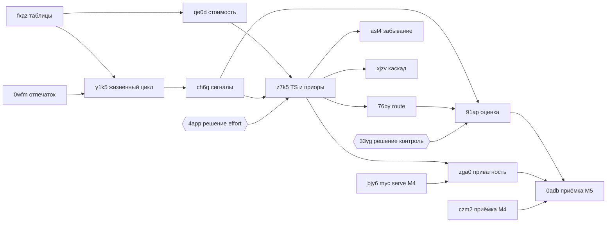
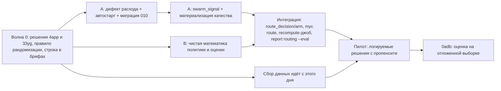

# Ревизия M5 «Самообучение роя»: что сделано, что осталось, в каком порядке

Задача: memory-nkwsbqssm24a · эпик memory-0dm3hdvdmr5c · дата: 2026-09-14 · код не менялся.

## Коротко

1. **Трекер говорит «0 из 12», код — примерно треть M5.** Сделан слой учёта:
   ростер моделей и цен с датой, попытка с вердиктом и оговорками, замороженная
   стоимость из стенограммы, класс `intent:scope` (с 0.3.7 — по факту, S67),
   `myc report models` с интервалами доверия, панель роутинга в вебе. Нет
   ничего из «обучающей» половины: сигналов исхода, материализации, приоров,
   Томпсон-семплинга, `myc route`, пропенсити, офлайн-оценки, сервера.
2. **Главная проблема не в коде, а в данных: попытки перестали записываться 7 дней назад.**
   В базе 35 попыток, все за 2026-09-05…07; за 2026-09-08…14 закрыто 83 задачи
   и не записано ни одной попытки. Из 21 попытки со стоимостью у двух расход взят
   из стенограммы *сессии координатора* ($2665 и $553 при медиане $30), и из-за
   этого `myc report models` на `feature:module` даёт перевёрнутый ответ
   («дешевле opus», а на чистых данных sonnet дешевле в 3.1 раза).
3. **Минимальный путь до приёмки — локальный, без M4.** Сейчас приёмка M5
   заблокирована приёмкой M4 и серверным валидатором — это лишние зависимости.
   Порядок: решения по двум вопросам → сбор данных (попытки пишет сам исполнитель,
   модель рандомизируется по правилу) → два агента параллельно (данные/сигналы и
   чистая математика политики/оценки) → интеграция `myc route` → пилот 3–4 недели
   на отложенной выборке.

---

## 1. Что и как проверено

- Код прочитан: `packages/swarm/src/*` (миграции 000–009, attribution, compare,
  taskclass, touched, launch, transcript, roster), `packages/cli/src/commands/{attempt,roster,tasks}.ts`,
  `packages/web/src/routing.ts`, `packages/server/src/index.ts`, дизайн
  `docs/design/04-swarm-learning-and-routing.md` целиком, ARCHITECTURE §9 и стыки S7, S9, S12–S15, S67.
- Тесты (без правок): `bun test packages/swarm packages/cli/src/commands/attempt.test.ts
  attempt.touched.test.ts attempt.live.test.ts roster.test.ts` — **273 теста, 0 падений**,
  988 `expect()`, 16 файлов, 9.3 с.
- Данные — только на копии: `sqlite3 -readonly .myc/myc.db ".backup <scratchpad>/ws/.myc/myc.db"`,
  все команды `myc -C <scratchpad>/ws …` с `MYC_HOME=<scratchpad>/home`. Рабочая база
  не открывалась ни одной пишущей командой.
- Два зонда во временном каталоге (в репозиторий не попадают): классификатор по всем
  задачам копии и статистика по попыткам. Числа из них приведены ниже вместе с запросами.

## 2. Состояние задач M5

Обозначения: ✅ сделано · 🟡 частично · ❌ нет. «Устарело» — формулировка задачи
расходится с принятыми решениями.

| Задача | Состояние | Что есть в коде (доказательства) | Чего нет | Формулировка |
|---|---|---|---|---|
| **fxazm220dtsq** Таблицы swarm_attempt, swarm_signal, swarm_route_decision, приоры | 🟡 ~40 % | Отдельные таблицы вне `nodes` и оплога (S13), свой набор миграций с учётом `swarm_schema_migrations`: `swarm_model` (001), `swarm_model_price` с `valid_from` (002), `swarm_attempt` (003), индексы задачи и руки (004, 005), `swarm_attempt_run` — контекст запуска (006, 007), харнесс codex перестройкой 4 таблиц (008), `predicted_class`/`scope_source`/`git_base` (009). На копии применены все 9. | `swarm_signal`, `swarm_outcome`, `swarm_route_decision`, `swarm_arm`, `swarm_config`, `swarm_attempt_event`. В `swarm_attempt` нет `routed/route_id/propensity`, `attempt_no/parent_attempt`, `fp_version`, `fingerprint`, `commit_shas`, времени исполнения; нет `orchestrator_model`/`judge_model` (требование эпика пула). Приёмка «сутки нагрузочной записи» не мерилась. | Частично: `swarm_attempt` сделан в форме W11 (вердикт + оговорки), а не §2.2 (статус + сигналы). Предлагаю править дизайн, см. §6 Р1. |
| **0wfmcf2kgbvb** Отпечаток: 28 классов intent × scope | 🟡 ключ ✅, признаки ❌ | `packages/swarm/src/taskclass.ts`: 7×4 enum (:21–35), лексикон ru+en (:56–85), приоритет при конфликте (:41–49), `computeScope` (:164–171), `FP_VERSION=1` (:19); источники scope touched→anchors→text (:238–261). Зонд на 317 задачах копии: предсказание+ключ **p50 0.06 мс, p99 0.16 мс** (второй проход; в первом единичный выброс 72.8 мс), первый вызов в свежем процессе 1.2–1.5 мс (3 запуска), два прохода — **0 расхождений**. Приёмка задачи («< 5 мс, два прогона — один класс») выполнена для ключа. | Контекстных признаков §2.1.2 нет вовсе (size, depth, ctx, langs, has_tests, has_criteria, spec_len, domain_hash, cluster_id). `fan_in` не читается: taskclass.ts:6–11 считает его нулём. | **Устарело дважды.** (1) «fan_in читается из якорей» — по S9 (исполнено 2026-09-12) число лежит в `code_refs (repo_id, name)` по имени символа, колонки у якоря нет. (2) По S67 ключ на финише — класс по факту (тронутые файлы), а на старте есть только `predicted_class`; «класс задачи» теперь две величины. |
| **y1k58t110cdq** Жизненный цикл попытки и git-трейлеры | 🟡 ~45 % | CLI `myc attempt start/finish/link/list/show/reclass` (attempt.ts:1809–1822); контекст запуска из окружения — сессия, pid, терминал, pane, диспетч через `orca … worker-list` (launch.ts:124, attempt.ts:218, :871); снимок деревьев на старте для факта (touched.ts:233, :293); `myc close --verdict` финиширует той же `finishWithFact` (attempt.ts:1337, tasks.ts:1509). `attempt list --live` различает working/orphan/lost. | `attempt event`, хуки Claude Code/Orca (`worker_done → finish`), `prepare-commit-msg` с `Myc-Attempt/Myc-Task` — ни одного упоминания в `packages/*/src`; перевод в `abandoned` по таймауту (попытка att_0a7c5f736e49 открыта с 2026-09-05); `task.current_attempt` при claim; строка в `myc doctor` про отсутствие хуков роя. | Частично устарело: в этом процессе агенты не коммитят, коммитит координатор пачками (S67: 43 из 50 отчётов в коммитах по 3–33 отчёта), трейлер связывает плохо. Связь попытки с кодом уже даёт снимок `git_base` + `files_touched`. |
| **ch6qen5t9rbe** Сигналы исхода, атрибуция, отложенные события | 🟡 ~15 % | Вердикт `accepted/rework/rejected` + 4 оговорки → `qualityOf` (attribution.ts:43–93), `OUTCOME_VERSION=1` (:63), `retries`. | Таблицы сигналов и материализации, каталог §2.3.1, формула §2.3.2, доля вины модели §2.3.3, сканы реверта/выживания/follow-up, хук `reopened`. Реверт через 7 дней апостериор не меняет — апостериора нет. | Устарело по модели сигнала: каталог §2.3.1 рассчитан на CI/мерж/ревью, а в оркестрованной работе главный сигнал — приёмка координатора с мутациями. Совмещать, а не заменять (§6 Р3). |
| **qe0dtdf1h3rz** Модель стоимости и функция полезности | 🟡 ~35 % | Прямая стоимость по строке цены на `started_at`, 4 статьи, заморожена на финише (attribution.ts:747–811, `#freezeCost` :929); расход из стенограммы со склейкой по `message.id` (transcript.ts:150, :168); устаревание цены 90 дней (roster.ts:37, :137); нулевая цена кеша и «цена правлена после заморозки» названы в отчёте (compare.ts:106–119). | Стоимость человека/координатора §2.4.2, латентность (33 из 34 попыток короче минуты — ретро-запись), множители size/ctx §2.4.3, `utility` и профили §2.4.4, `swarm_config`. **Дефект:** расход берётся из сессии того, кто вызвал `attempt start`, даже если это координатор (§4.3). | Формулировка верна; калибровку `ref` дизайна править (§6 Р6). |
| **z7k5x3bppvr0** Томпсон-семплинг и иерархические приоры | ❌ | Только кирпичи: `betaCdf/betaQuantile/qualityInterval` с равномерным приором (compare.ts:180–219). `packages/swarm/src/index.ts:1` — `TODO(myc-6j9): … Thompson-sampling priors`. | Всё: сэмплинг, пол/потолок исследования, глобальная таблица приоров §2.5.4, иерархия, заимствование у соседей, `N_MAX`, симуляция на 10k. | Ключ руки зависит от решения memory-4apptd0p81qd; на наших данных effort — константа модели (opus всегда high), см. §6 Р2. |
| **76byppzy2a2k** myc route, myc report models, MCP | 🟡 ~30 % | **`myc report models` есть** (attempt.ts:1882–1947, register.ts:51): классы, интервал 90 %, группа равного результата, самая дешёвая рука, покрытие стоимостью, `--class/--since/--min`. Веб-панель W12 читает ту же `compareModels` (packages/web/src/routing.ts:1–20). | `myc route` (`unknown command 'route'` на копии), `myc_route`/`myc_report_models` в MCP (инструментов роя в `packages/mcp` нет), `--goodhart/--fingerprint/--pareto`, `report routing --eval`, `report privacy`. | Частично сделана раньше под W11/W12 — задачу сузить до route + MCP. |
| **91apr1tp1qzw** Пропенсити, IPS/SNIPS/DR, контроль | ❌ | — (колонки пропенсити нет, решений роутера нет) | Всё. | Верна по сути; маргинал «не хуже на 0.02» (§2.11) на нашем объёме недостижим — §4.5, §6 Р7. Заблокирована решением memory-33yg0vapbkh5. |
| **zga00epa0rky** Приватность приоров и валидатор на сервере | ❌ | Сервер — M0-срез из трёх health-эндпоинтов (packages/server/src/index.ts:1–10). | Всё. Ждёт `myc serve` (memory-bjy6fq9kxj47) ← Postgres DDL (memory-2xgh8mg2fs24). | К локальной приёмке M5 не относится — это пул команды. Перенести в цепочку memory-x80d134ygdwy (§5). |
| **ast410zxvdpd** Забывание и детектор смены режима | ❌ | — | Всё. Кроме того, id моделей в ростере без версии (`opus`, `sonnet`) — наследовать апостериор «родителя» не от чего. | Для пилота в 3–4 недели не нужна (полураспад 60 суток); после приёмки. |
| **xjzvw9fyxkz0** Каскад и порог эскалации | ❌ | — | Всё. | После приёмки. В этом процессе проверка есть всегда (приёмка координатора), так что `d` ≈ 0.9 — формула применима. |
| **0adbcy3rhqj4** Приёмка M5 | ❌ | — | Данных нет (§4). | Блокеры memory-czm24d25q295 (приёмка M4) и memory-zga00epa0rky лишние — утверждение приёмки локальное (§5). |
| **d64pv4dw3m1j** Эпик пула статистики | 🟡 1 из 5 | memory-3hz420r5b0c7 закрыта (единый финиш `finishWithFact`, attempt.ts:1337). | Остальное — §7. | Верен; порядок совпадает с минимальным путём M5 в первых двух шагах. |

## 3. Что уже есть сверх формулировок задач

- **Контекст запуска с источником каждого факта** (`swarm_attempt_run`, 006):
  `session_source env|flag|search|none`, `dispatch_source env|flag|lookup|none`,
  `pid_source`, `proc_state`, `git_base`, `files_touched`. Дизайн этого не
  предусматривал, а для записи попыток самим исполнителем это ровно то, что нужно.
- **Класс по факту (S67):** снимок рабочих деревьев на старте (touched.ts),
  дифф на финише, ключ = факт → якоря → `unknown`, предсказание отдельно.
  `attempt reclass --dry-run` пересчитывает старые попытки.
- **Честный отчёт сравнения:** «равный результат» = пересечение интервалов
  Beta, а не равенство средних; ответ `ok / insufficient_attempts / no_cost_data / single_arm`,
  флаг `separationPending`, доля попыток со стоимостью (compare.ts:11–36, :311–381).
- **Стенограмма как источник расхода и модели:** `readTranscriptUsage` отдаёт и
  список моделей сессии (transcript.ts:221–222), но с моделью попытки его никто
  не сверяет (attempt.ts:1072 — только вывод).

## 4. Данные этого репозитория (копия базы, 2026-09-14)

### 4.1 Сколько и что записано

```sql
SELECT model_id, effort, count(*), sum(verdict='accepted'), sum(verdict='rework'),
       sum(caveats<>'[]'), sum(cost_basis='priced') FROM swarm_attempt GROUP BY 1,2;
```

| модель | попыток | принято | доработка | с оговорками | со стоимостью |
|---|---|---|---|---|---|
| opus@high | 24 (1 открыта) | 22 | 1 | 5 | 15 |
| sonnet@high | 8 | 8 | 0 | 3 | 6 |
| sonnet@medium | 1 | 1 | 0 | 0 | 0 |
| glm-flash@high | 2 | 2 | 0 | 2 | 0 |
| kimi-k3, fable | 0 | — | — | — | — |

- Всего 35 попыток, закрыто 34, все между 2026-09-05 16:16 и 2026-09-07 21:26.
- Все 35 — `source='cli'`; 32 с классом, названным координатором руками
  (`class_source='declared'`), 3 выведенных `feature:unknown`. `scope_source` и
  `predicted_class` пусты у всех 35: ни одна попытка не прошла через механизм S67.
- 33 из 34 закрытых длятся меньше минуты (старт и финиш одной командой —
  ретро-записи), одна — 4 ч 31 мин. Ось латентности фактически пуста.
- Покрытие: закрыто задач 216, с попыткой 33 (15 %). По дням:

| день | закрыто задач | с попыткой |
|---|---|---|
| 09-05 | 15 | 3 |
| 09-06 | 14 | 11 |
| 09-07 | 30 | 19 |
| 09-08…09-14 | 83 | **0** |

  У 63 из этих 83 задач есть нить комментариев, в 22 — слово «принят», в 14 —
  «доработ/вернул/возвра». Это сырьё для ретро-записи, но модель исполнителя в
  нём не названа — её даёт стенограмма исполнителя.

### 4.2 Метка исхода: разброс есть, но мало

Качество по `qualityOf` (вердикт минус штрафы оговорок):

| модель | n | q̄ | sd q | чистых принятий |
|---|---|---|---|---|
| opus | 23 | 0.902 | 0.208 | 78 % |
| sonnet | 9 | 0.856 | 0.236 | 67 % |
| glm-flash | 2 | 0.600 | 0 | 0 % |

Общее sd q = **0.218**. Тезис эпика пула «33 из 34 accepted — модели
неразличимы» верен для голого вердикта, но оговорки уже дают разброс: 10 из 34
закрытых (29 %) имеют q < 1. Разницы opus и sonnet (0.90 против 0.86) при
таких n не видно: интервалы перекрываются во всех классах.

### 4.3 Дефект данных: расход сессии координатора приписан исполнителям

Три строки `swarm_attempt_run` (att_9320591dca7b, att_696c6767c557, att_6289a214d584)
записаны с `session_source='env'`, `dispatch_source='none'` и одной и той же
сессией `a4814339-…` — это сессия координатора: стенограмма 88 МБ, 9924 записи
с моделью `claude-opus-5` и ни одной другой, пишется до сих пор (изменена
2026-09-14 15:56); на ней же координатор проверял работу att_0155485f75ba
(REPORT-t7w-session-key.md:16).
Две из трёх стоимостей — явно её расход:

| попытка | модель | чтений кеша | стоимость | медиана «чистых» |
|---|---|---|---|---|
| att_696c6767c557 | opus | 1 516 787 486 | **$2665.49** | $34.92 |
| att_6289a214d584 | sonnet | 1 581 423 702 | **$553.37** (токены opus по ставкам sonnet) | $7.78 |

Механизм: `attempt start`, вызванный координатором, записывает окружение
*своего* процесса, а `recordedSpend` (attempt.ts:1267) читает стенограмму по
`run.sessionId`, не спрашивая `isSelfAttributed` (launch.ts:240 — функция есть,
но используется только для живости процесса). Правило «`dispatch_source='none'` →
сессию для расхода не брать» отсекло бы все три плохие строки и сохранило бы
единственную хорошую (att_d69528cd24f4, `dispatch_source='lookup'`). Цена
правила: агент, запущенный человеком без оркестратора, тоже получит `none` и
потеряет автоматический расход — для него остаётся явный `--from-session`, а
отказ называется WARN, не молчанием. Вторая защита — сверка моделей стенограммы с семейством модели попытки: у
att_6289a214d584 записан sonnet, в стенограмме только opus.

**Следствие в отчёте:** на копии `myc report models` для `feature:module` отвечает
«cheapest is opus|high ($29.21 vs $100.04)». Без одной загрязнённой строки sonnet|high
стоит $9.37 за попытку (5 попыток) — в **3.1 раза дешевле** opus при перекрывающихся
интервалах качества (0.81 [0.49–0.94] против 0.87 [0.37–0.96]). Ответ меняет знак.
`feature:cross` показывает opus по $691.84 за попытку по той же причине.

### 4.4 Отпечаток на реальных задачах

Зонд по 317 задачам копии (`predictFromTask` и `keyFromTask` из attempt.ts,
пути из текста проверялись `stat` в рабочем дереве, только чтение):

- источник scope для предсказания: `none` 200 (63 %), `text` 110 (35 %), `anchors` 7 (2 %);
- на 32 попытках с классом координатора: **класс совпал 0 из 32, intent 25 из 32 (78 %),
  scope 1 из 32 (3 %)** — повтор замера S67 (1 из 10) на большей выборке;
- по закрытым задачам предсказание раскладывается в 23 из 28 классов, но только 8
  классов имеют ≥ 5 задач (`feature:unknown` 86, `fix:unknown` 36, `fix:local` 19,
  `feature:local` 16, `fix:module` 11, …).

Вывод: на момент решения роутер надёжно знает только intent (≈80 %, как и
обещал §2.1.3); scope на старте почти всегда неизвестен или неверен.

### 4.5 Хватает ли данных и сколько нужно

Сейчас — нет ни на что, кроме «opus дороже sonnet» (это видно и так). Роутинг
по классам не на чем учить, пропенсити не записана ни у одной попытки, поэтому
IPS/SNIPS по историческим данным невозможны в принципе: модель выбирал
координатор, вероятность выбора неизвестна.

Объём выборки при sd q = 0.218, α = 0.05, мощность 0.8:

| вопрос | на руку/группу |
|---|---|
| различить Δq = 0.20 (двусторонний) | 19 |
| различить Δq = 0.10 | 75 |
| различить Δq = 0.05 | 298 |
| «не хуже» с маргиналом 0.10 (односторонний) | 59 |
| «не хуже» с маргиналом 0.05 | 235 |
| «не хуже» с маргиналом 0.02 (как в §2.11) | **1468** |

Стоимость ограничением не является: sd ln(cost) у opus 0.31, у sonnet 0.93,
разница средних ln — 1.58 (в геометрическом среднем opus дороже в 4.8 раза);
её видно на десятке задач. Узкое место — доказать,
что качество не хуже.

Темп: 2026-09-05…14 закрыто 142 задачи — ≈ 14 в день, ≈ 100 в неделю.

- С контрольной группой 10 % (§2.11) даже маргинал 0.10 требует 59 контрольных
  задач = ≈ 590 решений ≈ 6 недель, маргинал 0.05 — ≈ 23 недели. Для этого
  репозитория это слишком медленно.
- **Предложение:** пилот с рандомизацией 50/50 между двумя основными руками
  (opus@high, sonnet@high) на задачах, заранее признанных допустимыми для обеих
  (например, `feature`/`fix`, не безопасность и не миграции). Тогда пропенсити
  = 0.5, веса IPS = 2, и в оценку идут все задачи, а не 10 %. Маргинал 0.10 →
  ≈ 120 рандомизированных задач ≈ 2 недели (если допустимы ≈ 60 % задач);
  плюс столько же на отложенную выборку («воспроизводится на отложенной
  выборке») — **≈ 4 недели**. Маргинал 0.05 — ≈ 470 задач, с отложенной
  выборкой ≈ 16 недель.
- Рандомизацию можно начать **до всякого кода роутера**: правило, объявленное
  заранее, например «первая hex-цифра sha256(task_id) чётная → sonnet, иначе opus»
  на допустимых задачах. Пропенсити тогда восстановима из правила и допишется
  в колонку, когда та появится. Риск ограничен: каждую работу принимает
  координатор с мутациями, провал sonnet обходится раундом доработки, и он же
  попадает в стоимость задачи.

### 4.6 Кто должен писать попытки

| шаг | кто | как сейчас | что сделать |
|---|---|---|---|
| старт | **исполнитель** (его окружение — его сессия, pid, терминал, диспетч) | координатор руками или никто | До кода: строка в брифе «первым делом `myc attempt start <id> --model <m>`». Код: автостарт попытки на `myc claim`/`ready --claim` в процессе агента, модель — из `MYC_MODEL` или стенограммы. |
| конец работы | исполнитель (`worker_done`) | не пишется | Отдельный момент `done_at` (латентность = старт → сдача, а не → вердикт). |
| вердикт | координатор | `myc close <id> --verdict … --caveat …` — работает, считает класс по факту | Без изменений; добавить `orchestrator_model`/`judge_model`. |
| доработка | координатор (новый диспетч) | не пишется | Вторая попытка с `parent_attempt`; первой — сигнал `redone`. |
| реверт/переоткрытие | фон | нет | Скан по `files_touched` + `git log`/`blame`, хук на `closed → open`. |

## 5. Граф зависимостей и порядок

### 5.1 Как сейчас в трекере



Цепочка до приёмки проходит через весь M4 (`myc serve` ← Postgres DDL, приёмка
M4 ← ещё 4 задачи), хотя утверждение приёмки — «офлайн-оценка показывает
экономию» — локальное.

### 5.2 Предлагаемые правки графа (не применял — решение координатора)

1. memory-0adbcy3rhqj4: снять блокеры memory-czm24d25q295 и memory-zga00epa0rky.
2. memory-zga00epa0rky: перевесить под memory-x80d134ygdwy (пул команды) —
   валидатор нужен там, где есть сервер.
3. memory-ast410zxvdpd, memory-xjzvw9fyxkz0: вынести за приёмку (P3, «после M5»).
4. memory-0wfmcf2kgbvb: закрыть по приёмке (ключ детерминирован, < 5 мс), а
   контекстные признаки §2.1.2 — отдельной P3-задачей, если понадобятся для
   поправки стоимости.
5. memory-76byppzy2a2k: сузить до `myc route` + MCP (отчёт уже есть).
6. Новые задачи (или подпункты существующих): «расход сессии координатора
   приписан исполнителю» (дефект, P1, до сбора данных); «автостарт попытки на
   claim в процессе агента»; «чистка трёх загрязнённых строк стоимости».
7. memory-rsje5wn1w75r и memory-y1k58t110cdq/memory-ch6qen5t9rbe — одна работа;
   связать `related` или сделать rsje подзадачей.

### 5.3 Минимальный путь до приёмки



Календарь определяет не код, а сбор: при ≈ 100 задачах в неделю и маргинале
0.10 нужно ≈ 4 недели рандомизированных данных. Поэтому волна 0 важнее всего —
сбор должен начаться до того, как появится роутер.

### 5.4 Два агента параллельно без пересечения файлов

| | Агент A — «данные и сигналы» | Агент B — «политика и оценка» (без БД) |
|---|---|---|
| Задачи | дефект расхода; автостарт на claim; миграция 010 (`orchestrator_model`, `judge_model`, `done_at`, `attempt_no`, `parent_attempt`, `routed`, `route_id`, `propensity` — одним ADD COLUMN, чтобы не перестраивать таблицы, как в 008); миграция 011 `swarm_signal`; качество из сигналов (`OUTCOME_VERSION=2`) — это fxaz (часть), y1k5, ch6q, rsje | Томпсон-семплинг, пол/потолок исследования, иерархия local+global (team — входом-заглушкой), глобальная таблица §2.5.4, `utility` и профили, пропенсити Монте-Карло, IPS/SNIPS/DR + бутстрэп-ДИ + ESS, симулятор — это z7k5, qe0d (часть), 91ap (методы) |
| Файлы | `packages/swarm/src/{attribution,launch}.ts`, `packages/swarm/src/signals.ts` (новый), `packages/swarm/src/migrations/{010,011}-*.ts`, `migrations/index.ts`, `packages/cli/src/commands/{attempt,tasks}.ts` | только новый каталог `packages/swarm/src/policy/*` + тесты; `compare.ts` — только импорт `betaQuantile` |
| Приёмка | ретро-запись 4 работ 2026-09-10 различается меткой (из rsje); `close --verdict` после старта исполнителем даёт `scope_source=touched` и расход его сессии; попытка координатора не получает его расход | симуляция 10k задач сходится к лучшей руке, доля исследования в [5 %, 15 %]; IPS/SNIPS на симулированных логах с известной истиной несмещены в пределах ДИ |

Общие точки: `packages/swarm/src/index.ts` (экспорты) — B его не трогает, тесты
импортируют по пути, экспорт добавит интеграция. Номера миграций раздать
заранее: 010–011 — A, 012 (`swarm_route_decision`, `swarm_arm`, `swarm_config`) —
интеграция. `jobs.kind` без CHECK (store-sqlite 001-init.ts:244), так что
`swarm_recompute` встаёт в существующий дренаж без миграции ядра.
`packages/web/src/routing.ts` зависит от формы `compareModels` — не менять её,
пока идёт перевод web.

## 6. Где дизайн расходится с кодом — что правим

| # | Расхождение | Что правим | Почему |
|---|---|---|---|
| Р1 | `swarm_attempt` в коде — вердикт + оговорки + замороженная цена; в §2.2 — `status/fail_reason` + сигналы + `fingerprint/propensity` | **Дизайн** принимает форму кода как основу; **код** добирает колонки миграцией 010 | Вердикт координатора — реальный и самый сильный сигнал этого процесса; колонки `routed/propensity/attempt_no` нужны оценке, их добавить дёшево. |
| Р2 | §2.5.3 роутит по `fp.task_class`, будто класс известен при решении; после S67 ключ руки — факт, а при решении известно только предсказание (scope совпал 1 из 32) | **Дизайн:** контекст роутера и оценки — то, что видно при решении. Ключ руки v1 = `(model, intent)`, scope — контекстом, пока матрица `predicted × task_class` по scope не даст ≥ 65 % на 200 попытках. Отчёт по факту остаётся по `task_class`. | Иначе офлайн-оценка сравнивает политику, которая видела не то, что записано; и 28 × моделей рук при 100 попытках в неделю в основном пусты. Это же отвечает на memory-4apptd0p81qd: effort в ключ не класть (у нас он константа модели). |
| Р3 | Качество: §2.3.2 — формула над сигналами; код — `qualityOf(verdict, caveats)` | **Оба:** `swarm_signal` в коде, где вердикт, каждая оговорка, доработка, правка координатора после сдачи, реверт — сигналы; `qualityOf` становится формулой v2 над ними | Сохраняет накопленное и даёт отложенные сигналы без компенсаций. |
| Р4 | «Атрибуция» в коде (attribution.ts — кто и чем исполнял) и §2.3.3 (доля вины модели против постановки) — одно слово, два смысла | **Дизайн:** §2.3.3 назвать «доля модели» (blame share) | Уже путает: задача ch6q говорит «атрибуция», а в коде это другое. |
| Р5 | id моделей: дизайн — с провайдером и версией; ростер — `opus`, `sonnet` | **Код/данные:** id с версией (`anthropic/claude-opus-5`), нынешние — алиасами | Без версии нет наследования апостериора и нет детекции дрейфа (ast4). Стенограмма уже называет модель (`claude-opus-5`). |
| Р6 | `ref.cost_usd = 2.0` (§2.4.4); реальная медиана — $34.9 (opus), $7.8 (sonnet) за попытку | **Дизайн:** `ref` — локальная медиана стоимости задачи, пересчитывается при материализации | При `balanced` слагаемое цены у opus 0.3·35/2 = 5.25 против максимума качества 0.6 — роутер выбирал бы самую дешёвую модель независимо от качества. |
| Р7 | §2.11: «не хуже на 0.02» и контроль 10 % | **Дизайн:** маргинал 0.10 для приёмки M5 (0.05 — цель), пилот с рандомизацией 50/50 на допустимых задачах, затем 10 % → 3 % | 0.02 требует 1468 задач на группу (§4.5). |
| Р8 | Приёмка «против фиксированной сильной модели» | **Дизайн/приёмка:** сравнивать с лучшей фиксированной политикой — и «всегда opus», и «всегда sonnet» | Если sonnet не хуже везде, «экономию против opus» даёт замена модели целиком, без всякого обучения; ценность роутера — только в неоднородности по классам. |
| Р9 | Связь с коммитом через трейлеры `prepare-commit-msg` (§2.2.2) | **Дизайн:** реверты и follow-up искать по `files_touched` (снимок S67) и `git log/blame` по этим путям; трейлеры — для процессов, где агент коммитит сам | В нашем процессе агенты не коммитят. |
| Р10 | Стоимость человека §2.4.2 | **Дизайн:** в рое «человек» — это координатор; вмешательство оценивать минутами на оговорку (как в §2.4.2), но по цене модели координатора | `coordinator_fixed` и доработка тратят токены координатора, которые сейчас не попадают ни в одну стоимость. |
| Р11 | Расход берётся из сессии вызывающего процесса без проверки | **Код** (дефект, §4.3) | Уже испортил ответ отчёта. |
| Р12 | §2.1.4 зовёт `graft.callers` с таймаутом 2 мс | **Дизайн:** ссылку на graft убрать, `depth` — из `storedFanIn` (S9) контекстным признаком; в правило scope не включать | Ключ scope теперь по факту (тронутые файлы), где fan-in не участвует. |

## 7. Эпик пула статистики (memory-d64pv4dw3m1j)

| Задача | Зависит от M5 | Когда начинать |
|---|---|---|
| memory-rsje5wn1w75r Метка с разбросом, попытки пишутся сами, оркестратор и судья | Это та же работа, что y1k5 + ch6q (агент A, волна 1) | **Сейчас**, первой. Без неё нет данных ни для M5, ни для пула. |
| memory-gxbf5h1kwya6 Польза одному пользователю, критерий остановки | Нужны данные волны 1; отчёт — расширение `compareModels` измерениями оркестратора/судьи | Критерий (N недель, порог) **объявить сейчас**, до сбора; сам отчёт — через 2–3 недели данных. Важно: этот критерий (модели различаются по классам) ≠ приёмке M5 (роутер экономит); M5 может пройти там, где критерий пула провалится. |
| memory-x80d134ygdwy Пул команды | Требует `myc serve` (M4) и валидатора (zga0); от политики M5 — только формат достаточных статистик | После M4-сервера и прохождения gxbf. Сюда же перевесить zga0. |
| memory-7n2h02wm1eer Публичный пул | После x80d | Только если пройден критерий gxbf. |
| memory-3hz420r5b0c7 | закрыта | — |

## 8. Что осталось неизвестным

- Стоимость att_9320591dca7b ($69.41) правдоподобна по величине, но строка
  запуска указывает на ту же чужую сессию; нужна ручная проверка стенограммы
  исполнителя (scripts/recost-attempts.ts).
- Какие модели исполняли 83 задачи 2026-09-08…14 — в базе нет; восстановимо по
  стенограммам исполнителей (`message.model`) и истории диспетчей orca.
- Реальная цена моделей для подписки (не по токенам) — вне кода; `cost_usd`
  здесь — оценка по прайсу ростера от 2026-09-05 (устареет 2026-12-04 по
  `PRICE_STALE_MS`).
